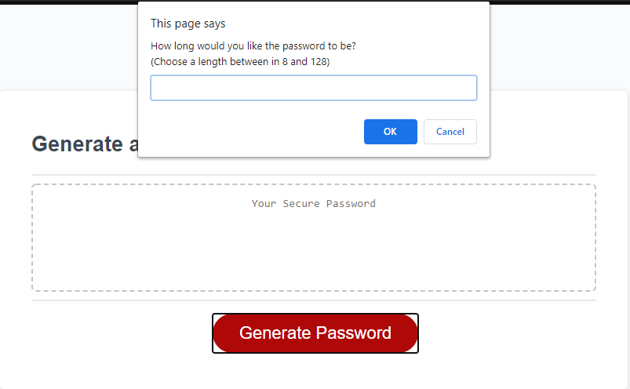
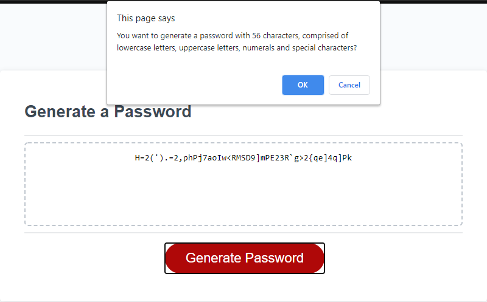
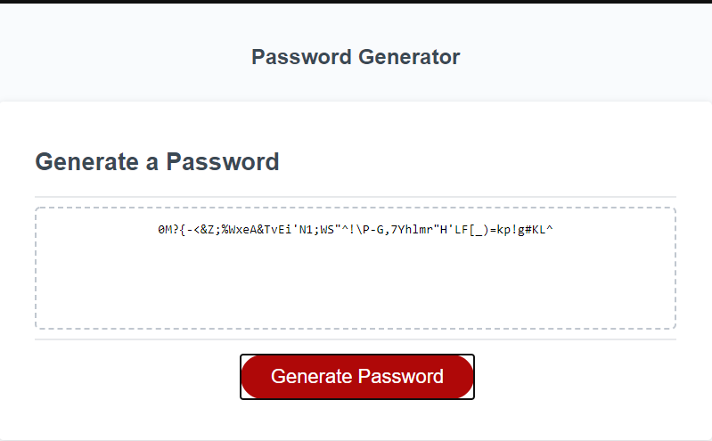

# Password-Generator

## About this Page

This simple password generator was built with existing HTML and CSS, it was a fun challenge to get user requirements for their password using prompt and confirm. 

## Features

In addition to validating user inputs, the script will also ask the user to confirm their choices prior to returing a result.  This added step added a significant amout of extra effort.

## Contents

* index.html
* README.md
* (components)
    * script.js
    * style.css
    8 (screenshots)

## Usage

This program will generate pseudo-random passwords with selection of length and allowed letters (uppercase and/or lowercase), numerals, and symbols.

## Credits

Much thank to MSU for the HTML and CSS for this project.

## License

This website is licensed under the MIT license copywrite 2020